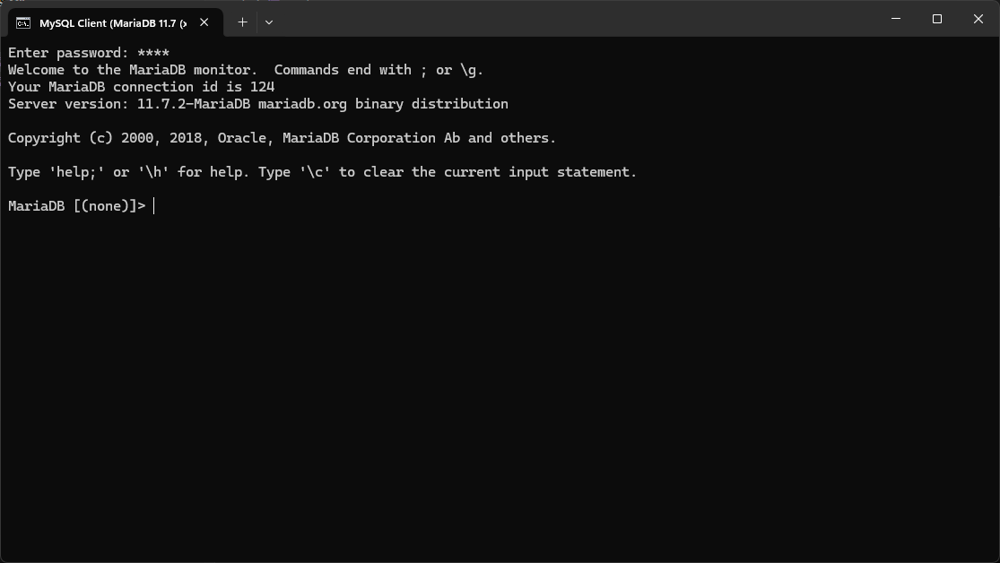
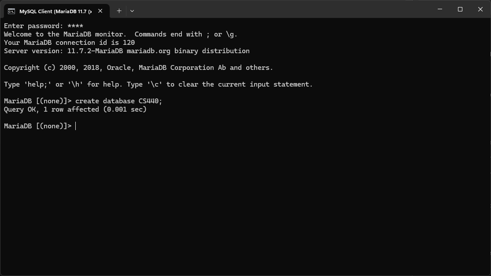

# CS 440 Final Project

## Installs

[Beekeeper studio](https://www.beekeeperstudio.io/) to easily see database contents and updates

[MariaDB](https://mariadb.org/) for da database

[Python 3](https://www.python.org/downloads/) for our scripts

Python dependencies also for our scripts

```bash
pip install mysql-connector-python sqlalchemy faker
```

## Create the new database

Log into your MySQL Client



Run the followin SQL command

```sql
CREATE DATABASE CS440;
```



## Run the GUI

```
python gui.py
```

Upon starting, you will be given a pop up to generate new data in the database, or delete all current data. Close this window to enter the application. 

## Notes

config.py - constants for database URL and data generation

custom_sql.py - custom sql queries

dbtypes - custom database types used by SQLAlchemy

delete.py - deletes contents of all tables in the database

generate.py - generates random data in the database

gui.py - application to run
